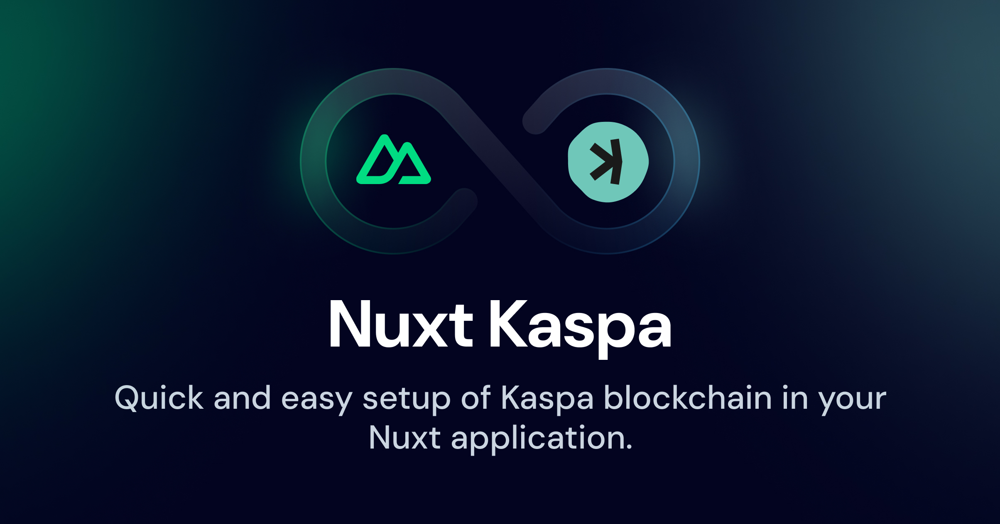

[](https://kaspa.nuxtjs.org)

# Nuxt Kaspa

[![npm version][npm-version-src]][npm-version-href]
[![npm downloads][npm-downloads-src]][npm-downloads-href]
[![License][license-src]][license-href]
[![Nuxt][nuxt-src]][nuxt-href]

## IMPORTANT: This module is in early development stage and is not ready for production use.

A Nuxt plugin for interacting with Kaspa blockchain

- [✨ &nbsp;Release Notes](/CHANGELOG.md)
  - [🏀 Online playground](https://stackblitz.com/github/furatamasensei/nuxt-kaspa?file=playground%2Fapp.vue)
  - [📖 &nbsp;Documentation](https://kaspa.nuxtjs.org)

## Features

<!-- Highlight some of the features your module provide here -->

- ⚡️ &nbsp;Quick & Easy integration with [Kaspa](https://kaspa.org): the fastest and most scalable Proof-of-Work blockchain
- 🔗 &nbsp;Easy access to common APIs through composables
- ⚙️ &nbsp;Configurable RPC setup through Nuxt config

## Quick Setup

Install the module to your Nuxt application with one command:

```bash
npx nuxi module add @kaspa/nuxt
```

That's it! You can now use Kaspa in your Nuxt app ✨

## Contribution

<details>
  <summary>Local development</summary>
  
  ```bash
  # Install dependencies
  npm install
  
  # Generate type stubs
  npm run dev:prepare
  
  # Develop with the playground
  npm run dev
  
  # Build the playground
  npm run dev:build
  
  # Run ESLint
  npm run lint
  
  # Release new version
  npm run release
  ```

</details>

<!-- Badges -->

[npm-version-src]: https://img.shields.io/npm/v/nuxt-kaspa/latest.svg?style=flat&colorA=020420&colorB=00DC82
[npm-version-href]: https://npmjs.com/package/nuxt-kaspa
[npm-downloads-src]: https://img.shields.io/npm/dm/nuxt-kaspa.svg?style=flat&colorA=020420&colorB=00DC82
[npm-downloads-href]: https://npm.chart.dev/nuxt-kaspa
[license-src]: https://img.shields.io/npm/l/nuxt-kaspa.svg?style=flat&colorA=020420&colorB=00DC82
[license-href]: https://npmjs.com/package/nuxt-kaspa
[nuxt-src]: https://img.shields.io/badge/Nuxt-020420?logo=nuxt.js
[nuxt-href]: https://nuxt.com
